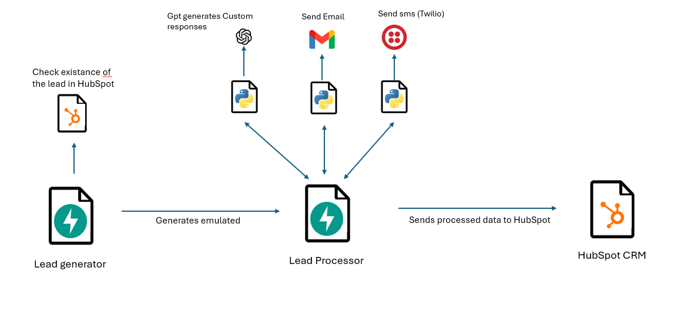

<a name="readme-top"></a>


<h3 align="center">Automatic lead managment</h3>

# Architecture of the solution

<p align="center">
  
</p>


</div>


<!-- TABLE OF CONTENTS -->
<details>
  <summary>Table of Contents</summary>
  <ol>
    <li>
      <a href="#about-the-project">About The Project</a>
      <ul>
        <li><a href="#built-with">Built With</a></li>
      </ul>
    </li>
    <li>
      <a href="#getting-started">Getting Started</a>
      <ul>
        <li><a href="#prerequisites">Prerequisites</a></li>
        <li><a href="#installation">Installation</a></li>
      </ul>
    </li>
    <li><a href="#usage">Usage</a></li>
  </ol>
</details>


<!-- ABOUT THE PROJECT -->
## About The Project


#The Lead Generation and Management System is a comprehensive solution designed to streamline the process of generating and managing leads for businesses. Leveraging various technologies and integrations, this system automates lead generation, captures lead information, and facilitates communication with potential customers through emails and SMS. Additionally, the system incorporates the use of GPT (Generative Pre-trained Transformer) for creating automatic and personalized responses to emails and SMS, enhancing the engagement and interaction with leads.


Key Features:


* FastAPI Backend: Utilizes FastAPI, a modern web framework for building APIs with Python, to handle HTTP requests and responses efficiently.

* Twilio Integration: Integrates with Twilio API to send SMS messages, allowing real-time communication with leads.

* HubSpot Integration: Integrates with HubSpot CRM API to manage lead data, including creation, retrieval, updating, and deletion of contacts.

* Email Communication: Enables communication with leads via email using SMTP protocol. Supports sending personalized email responses based on lead inquiries.

* Lead Generation Scripts: Provides scripts to generate leads either randomly or with specific names, simulating interactions with potential customers.

* GPT for Automatic Responses: Incorporates GPT (Generative Pre-trained Transformer) to create automatic and personalized responses to emails and SMS. GPT analyzes lead inquiries and generates relevant and engaging responses, enhancing lead interaction.


<p align="right">(<a href="#readme-top">back to top</a>)</p>


### Built With

* python
* FastaPI
* HubSpot
* openai

<p align="right">(<a href="#readme-top">back to top</a>)</p>


<!-- GETTING STARTED -->
## Getting Started


### Prerequisites

Make sure you have the following prerequisites installed:

- Python (3.7 or higher)
- Git (for version control)


* It is recommended to create your own environment for this project:


### Installation
1. Clone the repository to your local machine:

    ```
    git clone https://github.com/DavidNavarroSaiz/Automatic-lead-managment
    ```

2. Navigate to the project directory:

    ``` 
    cd your-project
    ```

3. Install project dependencies using `pip`:

    ```
    pip install -r requirements.txt
    ```

4. setup the environment variables:
    Follow these steps to set up the necessary environment variables for your project:

    Create a new file named .env in the root directory of your project.

    Open the .env file and add the following line with the corresponding values


    ```
    OPENAI_API_KEY= ""
    EMAIL_PASSWORD = ""
    TWILIO_ACCOUNT_SID = ''
    TWILIO_AUTH_TOKEN = ''
    TWILIO_PHONE_NUMBER = ''
    HUBSPOT_API_KEY= ''
    ```
    Save the .env file.

<p align="right">(<a href="#readme-top">back to top</a>)</p>


<!-- USAGE EXAMPLES -->
## Usage

### Generator Setup
for sending data to configure the send_data.json
there you will be putting the data of the emails that you want to send
in this case receiver email has to be configured properly in the google gmail api, you can follow this tutorial:
https://www.youtube.com/watch?v=g_j6ILT-X0k

{"sender_email": "",
 "receiver_email": "",
 "recipient_number": ""
}


## Lead Generator API 

in the file main_generator.py you will find methods to generate leads, it tries to emulate the leads process in two or more steps.

1. Run the FastAPI service:

    ```
    python main.py
    ```
    or using the console:

    ```
    uvicorn main:app --reload --port 8001
    ```
in this service you will find 3 important elements:
contact_info = {name: email, phone }
lead_messages = ["initial leads"]
response_messages = ["user responses"]

contact_info:  a list of people that will send the leads, and you will have important information such as email and phone that will be used to manage the lead with hubspot

lead_messages : list of examples of initial leads that a certain person could write, initial leads, include personal information such as phone, email  and gives a partial information about the requirement of the lead.

response_messages: it is a list of examples of responses over the initial leads that users can write, the response messages include more specific questions or specifications of the lead

#### 1. `/generate_lead_specific_name`

- **Method:** GET
- **Description:** Endpoint to generate leads with a specific email address.
- **Parameters:**
  - `email` (str): The email address for which a lead is to be generated.
- **Returns:**
  - `dict`: A dictionary containing the message indicating the lead generation status.

#### 2. `/generate_lead`

- **Method:** GET
- **Description:** Endpoint to generate leads with a random name.
- **Returns:**
  - `dict`: A dictionary containing the message indicating the lead generation status.


## Lead Processor API 

in the file main_processor.py you will find a function that joins different processing methods, it goe sover all the required steps to process a lead:

1. data extraction of the lead
2. automatic, custom and intelligent responses  to sms and email
3. upload the lead with important information to a CRM (in this case hubspot)

1. Run the FastAPI service:

    ```
    python main.py
    ```
    or using the console:

    ```
    uvicorn main:app --reload --port 8001
    ```
#### `/process_lead`

- **Method:** POST
- **Description:** Endpoint to receive leads, process them, and send responses via email and SMS.
- **Request Body:**
  - `lead_data` (dict): A dictionary containing the lead message.
    - `lead` (str): The lead message to be processed.
- **Returns:**
  - `dict`: A dictionary containing the response message.


<p align="right">(<a href="#readme-top">back to top</a>)</p>

